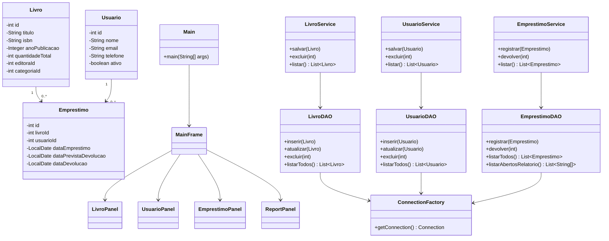

# Diagrama de Classes

Cole este Mermaid em um editor compativel para exportar em imagem/PDF.

```mermaid
classDiagram
    class Main {
        +main(String[] args)
    }

    class ConnectionFactory {
        +getConnection() Connection
    }

    class Livro {
        -int id
        -String titulo
        -String isbn
        -Integer anoPublicacao
        -int quantidadeTotal
        -int editoraId
        -int categoriaId
    }

    class Usuario {
        -int id
        -String nome
        -String email
        -String telefone
        -boolean ativo
    }

    class Emprestimo {
        -int id
        -int livroId
        -int usuarioId
        -LocalDate dataEmprestimo
        -LocalDate dataPrevistaDevolucao
        -LocalDate dataDevolucao
    }

    class LivroDAO {
        +inserir(Livro)
        +atualizar(Livro)
        +excluir(int)
        +listarTodos() List~Livro~
    }

    class UsuarioDAO {
        +inserir(Usuario)
        +atualizar(Usuario)
        +excluir(int)
        +listarTodos() List~Usuario~
    }

    class EmprestimoDAO {
        +registrar(Emprestimo)
        +devolver(int)
        +listarTodos() List~Emprestimo~
        +listarAbertosRelatorio() List~String[]~
    }

    class LivroService {
        +salvar(Livro)
        +excluir(int)
        +listar() List~Livro~
    }

    class UsuarioService {
        +salvar(Usuario)
        +excluir(int)
        +listar() List~Usuario~
    }

    class EmprestimoService {
        +registrar(Emprestimo)
        +devolver(int)
        +listar() List~Emprestimo~
    }

    Main --> MainFrame
    MainFrame --> LivroPanel
    MainFrame --> UsuarioPanel
    MainFrame --> EmprestimoPanel
    MainFrame --> ReportPanel
    LivroService --> LivroDAO
    UsuarioService --> UsuarioDAO
    EmprestimoService --> EmprestimoDAO
    LivroDAO --> ConnectionFactory
    UsuarioDAO --> ConnectionFactory
    EmprestimoDAO --> ConnectionFactory
    Livro "1" --> "0..*" Emprestimo
    Usuario "1" --> "0..*" Emprestimo
```
