# Modelo Conceitual - DER

Cole este Mermaid em um editor compativel, como Mermaid Live Editor ou draw.io com plugin Mermaid, para exportar em PNG/PDF.

```mermaid
erDiagram
    EDITORA ||--o{ LIVRO : publica
    CATEGORIA ||--o{ LIVRO : classifica
    LIVRO ||--o{ LIVRO_AUTOR : possui
    AUTOR ||--o{ LIVRO_AUTOR : escreve
    USUARIO ||--o{ EMPRESTIMO : realiza
    LIVRO ||--o{ EMPRESTIMO : emprestado_em

    EDITORA {
        int id PK
        string nome UK
        string telefone
    }

    CATEGORIA {
        int id PK
        string nome UK
    }

    AUTOR {
        int id PK
        string nome
        string nacionalidade
    }

    LIVRO {
        int id PK
        string titulo
        string isbn UK
        int ano_publicacao
        int quantidade_total
        int editora_id FK
        int categoria_id FK
    }

    LIVRO_AUTOR {
        int livro_id PK,FK
        int autor_id PK,FK
    }

    USUARIO {
        int id PK
        string nome
        string email UK
        string telefone
        boolean ativo
    }

    EMPRESTIMO {
        int id PK
        int livro_id FK
        int usuario_id FK
        date data_emprestimo
        date data_prevista_devolucao
        date data_devolucao
    }
```

## Regras principais

- Um livro pertence a uma editora e a uma categoria.
- Um livro pode ter varios autores e um autor pode escrever varios livros.
- Um usuario pode realizar varios emprestimos.
- Um livro nao pode ser emprestado quando nao houver exemplares disponiveis.
